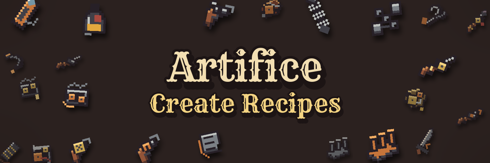

# Artifice Create Recipes

A NeoForge 1.21.1 addon that replaces [Iron's Arms 'n Artifice](https://modrinth.com/mod/irons-artifice) crafting recipes with [Create](https://modrinth.com/mod/create) assembly lines, mixing, and compacting. Guns, bullets, and components have to come out of a factory. It is required on both the client and the server. Hat recipes are unchanged.

Requires NeoForge 21.1.248+, Create 6.0.10+, and Iron's Arms 'n Artifice. Development notes are in [docs/development.md](docs/development.md), and the full design rationale is in [docs/final-recipe-proposal.md](docs/final-recipe-proposal.md).

## Recipes

Sequenced assembly steps are deployer steps unless marked **Saw** (cutting), **Press** (pressing), or **Fill** (spout). The first item is the starting item; the rest of the sequence repeats once per loop.

| Output | Machine | Inputs |
| --- | --- | --- |
| Blackpowder | Mixing | 2× Charcoal |
| 3× Blackpowder | Mixing | Charcoal, Redstone |
| 8× Blackpowder | Mixing | Charcoal, Redstone, Gunpowder |
| 24× Bullet | Sequenced Assembly, 6 loops | Iron Sheet → Blackpowder ×4 → Press |
| 6× Bullet | Sequenced Assembly, 2 loops | Copper Sheet → Blackpowder ×3 → Press |
| Simple Mechanical Components | Sequenced Assembly, 2 loops | Copper Sheet → Andesite Alloy → Cogwheel → Iron Sheet → Blackpowder → Press |
| Mechanical Components | Sequenced Assembly, 2 loops | Simple Mechanical Components → Brass Sheet → Large Cogwheel → Iron Sheet ×2 → Redstone → Press |
| Clockwork Components | Sequenced Assembly, 2 loops | Precision Mechanism → Mechanical Components → Brass Sheet ×2 → Golden Sheet → Press |
| Flintlock | Sequenced Assembly, 2 loops | Flint → Log → Iron Sheet ×2 → Andesite Alloy → Saw → Press |
| Musket | Sequenced Assembly, 3 loops | Simple Mechanical Components → Log → Iron Sheet ×2 → Andesite Alloy → Saw → Press |
| Blunderbuss | Sequenced Assembly, 3 loops | Simple Mechanical Components → Andesite Alloy → Log → Copper Sheet → Iron Sheet → Saw → Press |
| Blackpowder Revolver | Sequenced Assembly, 2 loops | Mechanical Components → Log → Iron Sheet ×2 → Blackpowder → Saw → Press |
| Six Shooter | Sequenced Assembly, 2 loops | Mechanical Components → Brass Sheet → Log → Iron Sheet ×2 → Saw → Press |
| Arquebus | Sequenced Assembly, 3 loops | Clockwork Components → Log → Iron Sheet ×2 → Brass Sheet → Saw → Press |
| Clockwork Rifle | Sequenced Assembly, 3 loops | Clockwork Components → Netherite Scrap → Log → Iron Sheet → Brass Sheet → Saw → Press |
| Hair Trigger Modifier | Sequenced Assembly | Simple Mechanical Components → Copper Sheet → Iron Sheet ×2 → Saw → Press |
| Buffer Spring Modifier | Sequenced Assembly, 2 loops | Simple Mechanical Components → Iron Sheet ×3 → Andesite Alloy → Saw → Press |
| Gas Vent Modifier | Sequenced Assembly | Simple Mechanical Components → Hopper → Simple Mechanical Components → Iron Sheet ×2 → Press |
| Mechanical Accelerator Modifier | Sequenced Assembly, 2 loops | Mechanical Components → Chain → Copper Sheet → Shaft → Press |
| Mechanical Repeater Modifier | Sequenced Assembly, 2 loops | Clockwork Components → Chain → Brass Sheet → Golden Sheet → Press |
| Scope Attachment Modifier | Sequenced Assembly | Simple Mechanical Components → Spyglass → Iron Sheet → Press |
| Bayonet Attachment Modifier | Sequenced Assembly | Iron Sword → Simple Mechanical Components → Andesite Alloy → Press |
| Suppressor Attachment Modifier | Sequenced Assembly | Clockwork Components → Leather ×2 → Golden Sheet → Iron Sheet ×2 → Press |
| Gun Oil Modifier | Sequenced Assembly | Simple Mechanical Components → Redstone → Fill 250 mB Honey |
| Chain Shot Modifier | Sequenced Assembly | Bullet → Chain ×4 → Bullet → Press |
| Hook Shot Modifier | Sequenced Assembly, 2 loops | Bullet → Iron Sheet ×2 → Chain → Andesite Alloy → Press |
| Blackpowder Charge Modifier | Compacting | 8× Blackpowder, 2× String |
| Scattershot Modifier | Compacting | 4× Bullet, 4× Blackpowder, 2× String |
| Breaching Shell Modifier | Compacting | 2× Copper Sheet, 2× Iron Sheet, 4× Blackpowder, 3× Flint |
| Incendiary Tip Modifier | Compacting | 3× Iron Sheet, 4× Blackpowder, 3× Blaze Powder |
| Frozen Jacket Modifier | Compacting | 3× Iron Sheet, 4× Blackpowder, 3× Blue Ice |
| Voltaic Core Modifier | Compacting | 2× Copper Sheet, Brass Sheet, 4× Blackpowder, 3× Lightning Rod |
| Steel Core Modifier | Compacting | Iron Block, 3× Iron Sheet, 4× Blackpowder |
| Lead Core Modifier | Compacting | Deepslate Bricks, 3× Iron Sheet, 2× Andesite Alloy, 4× Blackpowder |
| Trick Bullet Modifier | Compacting | Gold Block, 2× Golden Sheet, Brass Sheet, 4× Blackpowder |
| Spiral Tip Modifier | Compacting | 2× Iron Sheet, Brass Sheet, Nautilus Shell, 4× Blackpowder |
| Wind Chamber Modifier | Compacting | Copper Sheet, Brass Sheet, Wind Charge, 4× Blackpowder |
| Antigravity Powder Modifier | Mixing | 4× Blackpowder, Ender Pearl |
| Seeking Powder Modifier | Mixing | 4× Blackpowder, Amethyst Cluster |
| Overcharged Powder Modifier | Mixing (heated) | 8× Blackpowder, Redstone Block, 2× Blaze Powder |
| Enchanted Bullet Modifier | Mixing | Bullet, 4× Blackpowder, 3× Lapis Lazuli |
| Singularity Charge Modifier | Mixing | 4× Blackpowder, 4× Amethyst Shard, Ender Eye, Brass Sheet |
| Venom Capsule Modifier | Mixing | Bullet, Glass Bottle, 3× Spider Eye |
| Bloodletting Tip Modifier | Mixing | 4× Blackpowder, 3× Quartz, Ghast Tear, Redstone |

## Attribution

- [Create](https://modrinth.com/mod/create) by the Creators of Create: machines and processing recipes.
- [Iron's Arms 'n Artifice](https://modrinth.com/mod/irons-artifice) by iron431: the guns, ammo, and modifiers this addon rebalances.
- [NeoForge](https://neoforged.net/): mod loader.
- [Rye](https://fonts.google.com/specimen/Rye) by Nicole Fally (SIL Open Font License): banner lettering.

All workpiece sprites, the icon, and the banner are original artwork drawn by the scripts in `tools/`.
